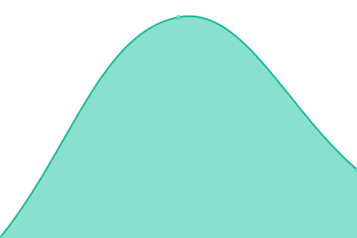
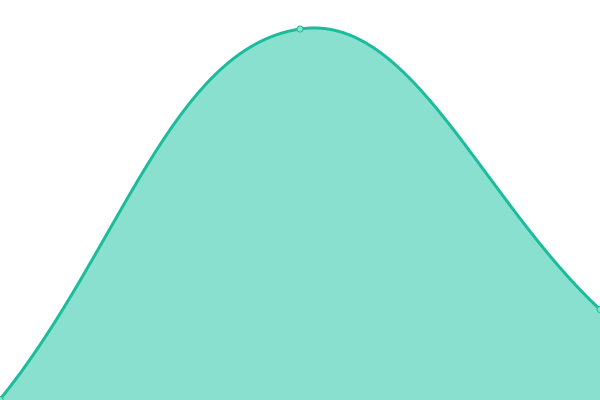

# [📈 Gik•叽喳 Status](https://giki.app): <!--live status--> **🟧 Partial outage**

This repository contains the open-source uptime monitor and status page for [Upptime](https://upptime.js.org), powered by [Upptime](https://github.com/upptime/upptime).

<!--start: status pages-->
<!-- This summary is generated by Upptime (https://github.com/upptime/upptime) -->
<!-- Do not edit this manually, your changes will be overwritten -->
<!-- prettier-ignore -->
| URL | Status | History | Response Time | Uptime |
| --- | ------ | ------- | ------------- | ------ |
| [giki.app](https://giki.app) | 🟩 Up | [giki-app.yml](https://github.com/gikiapp/status/commits/master/history/giki-app.yml) | 

 817ms
     
 | 

   

| [api.giki.app/ping](https://api.giki.app/ping) | 🟩 Up | [api-giki-app-ping.yml](https://github.com/gikiapp/status/commits/master/history/api-giki-app-ping.yml) | 

 1296ms
     
 | 

   

| [POST api.giki.app/talks](https://api.giki.app/talks) | 🟥 Down | [post-api-giki-app-talks.yml](https://github.com/gikiapp/status/commits/master/history/post-api-giki-app-talks.yml) | 

 727ms
     
 | 

   

| [GET api.giki.app/talks](https://api.giki.app/talks?user_name=i) | 🟩 Up | [get-api-giki-app-talks.yml](https://github.com/gikiapp/status/commits/master/history/get-api-giki-app-talks.yml) | 

 340ms
     
 | 

   

| [GET api.giki.app/users](https://api.giki.app/users?name=i) | 🟩 Up | [get-api-giki-app-users.yml](https://github.com/gikiapp/status/commits/master/history/get-api-giki-app-users.yml) | 

 306ms
     
 | 

   

| [GET api.giki.app/user/login](https://api.giki.app/user/login) | 🟥 Down | [get-api-giki-app-user-login.yml](https://github.com/gikiapp/status/commits/master/history/get-api-giki-app-user-login.yml) | 

 287ms
     
 | 

   

<!--end: status pages-->

[**Visit our status website →**](https://gikiapp.github.io/status)

## 📄 License

- Code: [MIT](./LICENSE) © [Upptime](https://upptime.js.org)
- Data in the `./history` directory: [Open Database License](https://opendatacommons.org/licenses/odbl/1-0/)
