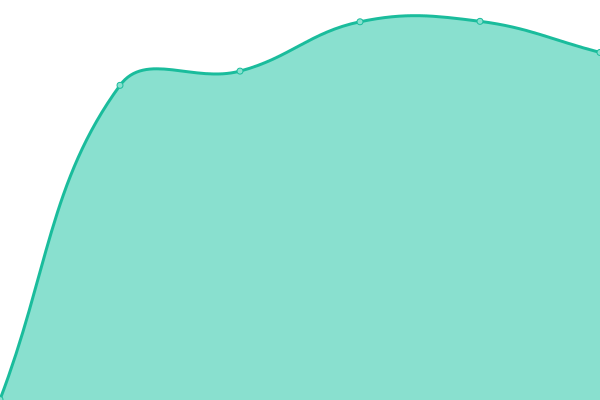
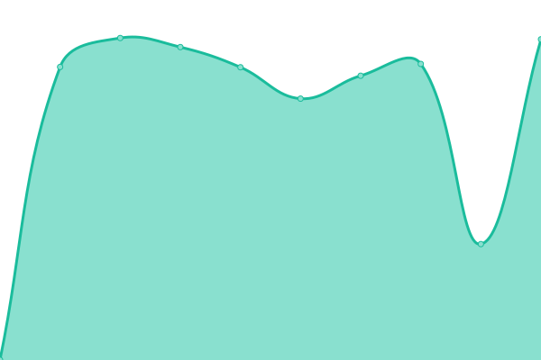

# [📈 Gik•叽喳 Status](https://giki.app): <!--live status--> **🟩 All systems operational**

This repository contains the open-source uptime monitor and status page for [Upptime](https://upptime.js.org), powered by [Upptime](https://github.com/upptime/upptime).

<!--start: status pages-->
<!-- This summary is generated by Upptime (https://github.com/upptime/upptime) -->
<!-- Do not edit this manually, your changes will be overwritten -->

| URL                                       | Status | History                                                                                       | Response Time                                                                      | Uptime                                                                                                                                                                                                                 |
| ----------------------------------------- | ------ | --------------------------------------------------------------------------------------------- | ---------------------------------------------------------------------------------- | ---------------------------------------------------------------------------------------------------------------------------------------------------------------------------------------------------------------------- |
| [giki.app](https://giki.app)              | 🟩 Up  | [giki-app.yml](https://github.com/gikiapp/status/commits/master/history/giki-app.yml)         |  805ms      |          |
| [api.giki.app](https://api.giki.app/ping) | 🟩 Up  | [api-giki-app.yml](https://github.com/gikiapp/status/commits/master/history/api-giki-app.yml) |  1869ms |  |

<!--end: status pages-->

[**Visit our status website →**](https://gikiapp.github.io/status)

## 📄 License

- Code: [MIT](./LICENSE) © [Upptime](https://upptime.js.org)
- Data in the `./history` directory: [Open Database License](https://opendatacommons.org/licenses/odbl/1-0/)
