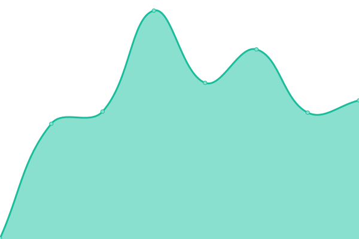

# [📈 Giki•叽喳 Status](https://giki.app): <!--live status--> **🟧 Partial outage**

This repository contains the open-source uptime monitor and status page for [Upptime](https://upptime.js.org), powered by [Upptime](https://github.com/upptime/upptime).

<!--start: status pages-->
<!-- This summary is generated by Upptime (https://github.com/upptime/upptime) -->
<!-- Do not edit this manually, your changes will be overwritten -->
<!-- prettier-ignore -->
| URL | Status | History | Response Time | Uptime |
| --- | ------ | ------- | ------------- | ------ |
|  [giki.app](https://giki.app) | 🟥 Down | [giki-app.yml](https://github.com/dailymemo/status/commits/HEAD/history/giki-app.yml) | 

 0ms
     
 | 

<a href="https://gikiapp.github.io/status/history/giki-app">0.00%</a>
    

|  [giki.app/api/ping](https://giki.app/api/ping) | 🟥 Down | [giki-app-api-ping.yml](https://github.com/dailymemo/status/commits/HEAD/history/giki-app-api-ping.yml) | 

 0ms
     
 | 

<a href="https://gikiapp.github.io/status/history/giki-app-api-ping">0.00%</a>
    

|  [i.giki.app](https://i.giki.app) | 🟥 Down | [i-giki-app.yml](https://github.com/dailymemo/status/commits/HEAD/history/i-giki-app.yml) | 

 0ms
     
 | 

<a href="https://gikiapp.github.io/status/history/i-giki-app">0.00%</a>
    

|  [giki.app/discover](https://giki.app/discover) | 🟥 Down | [giki-app-discover.yml](https://github.com/dailymemo/status/commits/HEAD/history/giki-app-discover.yml) | 

 0ms
     
 | 

<a href="https://gikiapp.github.io/status/history/giki-app-discover">0.00%</a>
    

|  [i.giki.app/discover](https://i.giki.app/discover) | 🟥 Down | [i-giki-app-discover.yml](https://github.com/dailymemo/status/commits/HEAD/history/i-giki-app-discover.yml) | 

 0ms
     
 | 

<a href="https://gikiapp.github.io/status/history/i-giki-app-discover">0.00%</a>
    

|  [get users graph.minghe.me](https://graph.minghe.me) | 🟩 Up | [get-users-graph-minghe-me.yml](https://github.com/dailymemo/status/commits/HEAD/history/get-users-graph-minghe-me.yml) | 

 651ms
     
 | 

<a href="https://gikiapp.github.io/status/history/get-users-graph-minghe-me">100.00%</a>
    

|  [create talks graph.minghe.me](https://graph.minghe.me) | 🟩 Up | [create-talks-graph-minghe-me.yml](https://github.com/dailymemo/status/commits/HEAD/history/create-talks-graph-minghe-me.yml) | 

 234ms
     
 | 

<a href="https://gikiapp.github.io/status/history/create-talks-graph-minghe-me">100.00%</a>
    

|  [delete talks graph.minghe.me](https://graph.minghe.me) | 🟩 Up | [delete-talks-graph-minghe-me.yml](https://github.com/dailymemo/status/commits/HEAD/history/delete-talks-graph-minghe-me.yml) | 

 237ms
     
 | 

<a href="https://gikiapp.github.io/status/history/delete-talks-graph-minghe-me">100.00%</a>
    

|  [query talks graph.minghe.me](https://graph.minghe.me) | 🟩 Up | [query-talks-graph-minghe-me.yml](https://github.com/dailymemo/status/commits/HEAD/history/query-talks-graph-minghe-me.yml) | 

 12ms
     
 | 

<a href="https://gikiapp.github.io/status/history/query-talks-graph-minghe-me">100.00%</a>
    

|  [blog.minghe.me](https://blog.minghe.me) | 🟥 Down | [blog-minghe-me.yml](https://github.com/dailymemo/status/commits/HEAD/history/blog-minghe-me.yml) | 

 1333ms
     
 | 

<a href="https://gikiapp.github.io/status/history/blog-minghe-me">100.00%</a>
    

|  [nextcloud.minghe.me](https://nextcloud.minghe.me) | 🟥 Down | [nextcloud-minghe-me.yml](https://github.com/dailymemo/status/commits/HEAD/history/nextcloud-minghe-me.yml) | 

 124ms
     
 | 

<a href="https://gikiapp.github.io/status/history/nextcloud-minghe-me">0.00%</a>
    

<!--end: status pages-->

[**Visit our status website →**](https://gikiapp.github.io/status)

## 📄 License

- Code: [MIT](./LICENSE) © [Upptime](https://upptime.js.org)
- Data in the `./history` directory: [Open Database License](https://opendatacommons.org/licenses/odbl/1-0/)
