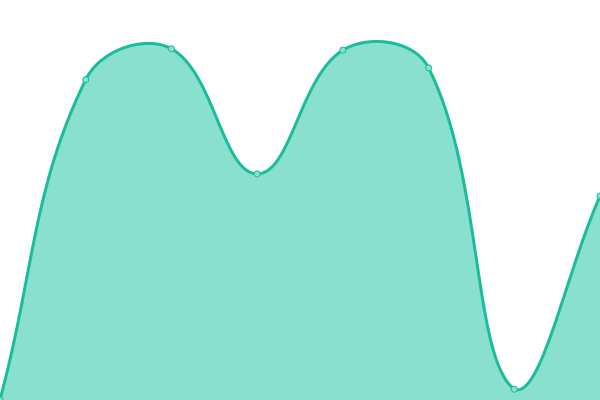

# [📈 Gik•叽喳 Status](https://giki.app): <!--live status--> **🟩 All systems operational**

This repository contains the open-source uptime monitor and status page for [Upptime](https://upptime.js.org), powered by [Upptime](https://github.com/upptime/upptime).

<!--start: status pages-->
<!-- This summary is generated by Upptime (https://github.com/upptime/upptime) -->
<!-- Do not edit this manually, your changes will be overwritten -->
<!-- prettier-ignore -->
| URL | Status | History | Response Time | Uptime |
| --- | ------ | ------- | ------------- | ------ |
|  [giki.app](https://giki.app) | 🟩 Up | [giki-app.yml](https://github.com/gikiapp/status/commits/HEAD/history/giki-app.yml) | 

 178ms
     
 | 

<a href="https://gikiapp.github.io/status/history/giki-app">100.00%</a>
    

|  [giki.app/api/ping](https://giki.app/api/ping) | 🟩 Up | [giki-app-api-ping.yml](https://github.com/gikiapp/status/commits/HEAD/history/giki-app-api-ping.yml) | 

 2367ms
     
 | 

<a href="https://gikiapp.github.io/status/history/giki-app-api-ping">100.00%</a>
    

|  [POST giki.app/api/talks](https://giki.app/api/talks) | 🟩 Up | [post-giki-app-api-talks.yml](https://github.com/gikiapp/status/commits/HEAD/history/post-giki-app-api-talks.yml) | 

 458ms
     
 | 

<a href="https://gikiapp.github.io/status/history/post-giki-app-api-talks">10.35%</a>
    

|  [GET giki.app/api/talks](https://giki.app/api/talks?user_name=i) | 🟩 Up | [get-giki-app-api-talks.yml](https://github.com/gikiapp/status/commits/HEAD/history/get-giki-app-api-talks.yml) | 

 683ms
     
 | 

<a href="https://gikiapp.github.io/status/history/get-giki-app-api-talks">100.00%</a>
    

|  [GET giki.app/api/users](https://giki.app/api/users?name=i) | 🟩 Up | [get-giki-app-api-users.yml](https://github.com/gikiapp/status/commits/HEAD/history/get-giki-app-api-users.yml) | 

 459ms
     
 | 

<a href="https://gikiapp.github.io/status/history/get-giki-app-api-users">100.00%</a>
    

|  [POST giki.app/api/user/login](https://giki.app/api/user/login) | 🟩 Up | [post-giki-app-api-user-login.yml](https://github.com/gikiapp/status/commits/HEAD/history/post-giki-app-api-user-login.yml) | 

 2688ms
     
 | 

<a href="https://gikiapp.github.io/status/history/post-giki-app-api-user-login">100.00%</a>
    

|  [POST giki.app/api/iap/validate](https://giki.app/api/iap/validate) | 🟩 Up | [post-giki-app-api-iap-validate.yml](https://github.com/gikiapp/status/commits/HEAD/history/post-giki-app-api-iap-validate.yml) | 

 2373ms
     
 | 

<a href="https://gikiapp.github.io/status/history/post-giki-app-api-iap-validate">10.35%</a>
    

<!--end: status pages-->

[**Visit our status website →**](https://gikiapp.github.io/status)

## 📄 License

- Code: [MIT](./LICENSE) © [Upptime](https://upptime.js.org)
- Data in the `./history` directory: [Open Database License](https://opendatacommons.org/licenses/odbl/1-0/)
